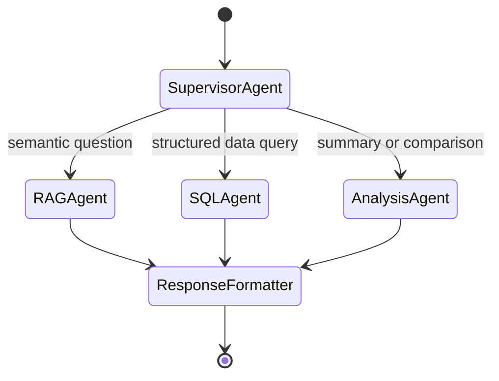

# Agentic Workflow Architecture

!!! info "Planned Architecture (Future Phases)"
    The agentic system is implemented in **Phase 5** (Weeks 17–19). This document describes the planned design.

---

## Overview

FinSight's agent layer uses **LangGraph** to orchestrate a multi-agent system. When a user submits a query through the chat interface, the supervisor agent routes it to the appropriate specialist tool — RAG retrieval, SQL generation, or direct LLM analysis.

---

## Agent Graph

---

## Agents

### Supervisor Agent

<!-- Describe routing logic, intent classification, fallback behavior -->

### RAG Agent

<!-- Describe how it calls the RAG pipeline, context injection, response synthesis -->

### SQL Agent

<!-- Describe how it generates PostgreSQL queries from natural language, safety constraints -->

### Analysis Agent

<!-- Describe how it performs multi-document comparison and financial summarization -->

---

## MCP Tools

<!-- Describe the Model Context Protocol tools registered: search_reports, query_financials, get_company_profile -->

---

## Observability with Langfuse

<!-- Describe trace logging per agent turn, cost tracking, latency SLAs -->

---

## Safety and Guardrails

<!-- Describe input validation, SQL injection prevention, PII handling, rate limits per user -->
