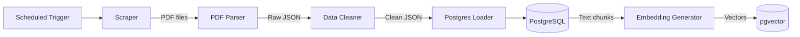

# Data Pipeline Architecture

!!! success "Current MVP"
    The current pipeline covers automated PDF download, PyMuPDF parsing, data cleaning, and PostgreSQL ingestion orchestrated via Airflow or Prefect.

---

## Pipeline Overview

---

## Stages

### Stage 1 — Scraping

<!-- Describe scraping targets, trigger schedule, storage of raw PDFs -->

### Stage 2 — PDF Parsing

<!-- Describe PyMuPDF extraction: text, tables, metadata; output JSON schema -->

### Stage 3 — Data Cleaning

<!-- Describe noise removal, financial table normalization, schema mapping -->

### Stage 4 — Database Ingestion

<!-- Describe upsert logic, deduplication, data versioning -->

### Stage 5 — Embedding Generation

!!! info "Planned Architecture (Future Phases)"
    Embedding generation and pgvector indexing is implemented in Phase 3.

<!-- Describe chunking strategy, embedding model, pgvector index creation -->

---

## Orchestration

<!-- Describe DAG design in Airflow/Prefect, retry strategy, alerting on failure -->

---

## Output Schema

<!-- Document the PostgreSQL table schemas produced by this pipeline -->
