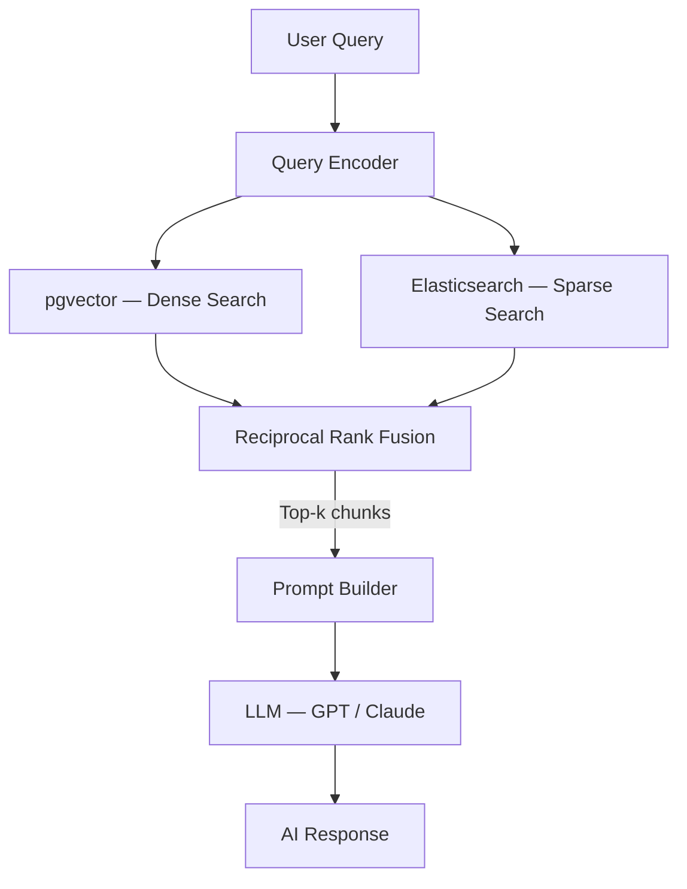

# RAG Architecture

!!! info "Planned Architecture (Future Phases)"
    The RAG system is implemented in **Phase 3** (Weeks 8–11). This document describes the planned design.

---

## Overview

FinSight uses a **hybrid retrieval** strategy combining dense vector search (pgvector) and sparse keyword search (Elasticsearch) to retrieve the most relevant financial document chunks before passing them to an LLM.

---

## Architecture Diagram

---

## Retrieval Strategy

### Dense Retrieval (pgvector)

<!-- Describe embedding model choice, cosine similarity threshold, top-k selection -->

### Sparse Retrieval (Elasticsearch)

<!-- Describe BM25 configuration, index fields, hybrid query weighting -->

### Reciprocal Rank Fusion

<!-- Describe RRF parameters, final reranking before context injection -->

---

## Prompt Design

<!-- Describe system prompt structure, context window limits, financial domain instructions -->

---

## Context Window Management

<!-- Describe chunking strategy: chunk size, overlap, metadata tagging by company/period -->

---

## Observability

<!-- Describe Langfuse integration: trace IDs, token counts, retrieval scores, latency logging -->
