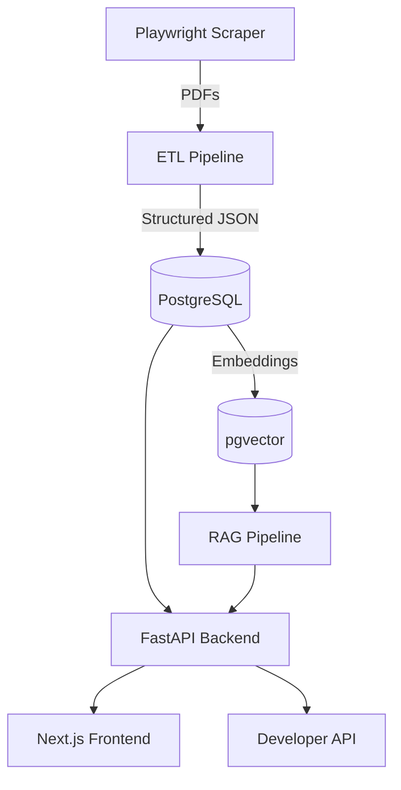

# System Architecture

!!! success "Current MVP"
    The MVP system spans a scraping layer, ETL pipeline, PostgreSQL database, and FastAPI backend with a Next.js frontend.

---

## High-Level Diagram

---

## Component Overview

| Component | Technology | Status |
|---|---|---|
| Web Scraper | Playwright / Selenium | ✅ Current |
| PDF Parser | PyMuPDF | ✅ Current |
| Pipeline Orchestrator | Airflow / Prefect | ✅ Current |
| Relational Database | PostgreSQL | ✅ Current |
| Vector Store | pgvector | ✅ Current |
| Search Engine | Elasticsearch | 🚧 Planned |
| Backend API | FastAPI | ✅ Current |
| Frontend | Next.js | ✅ Current |
| AI / RAG Layer | LangGraph + pgvector | 🚧 Planned |
| Cache / Rate Limiter | Redis | 🚧 Planned |
| ML Models | PyTorch / XGBoost | 🚧 Planned |

---

## Service Boundaries

<!-- Describe how each service communicates: REST, async queues, internal Docker networking -->

---

## Infrastructure Overview

<!-- Describe Docker compose layout, environment separation (dev / staging / prod), CI/CD entrypoints -->

---

## Security Boundaries

<!-- Describe auth perimeter: public API, authenticated API, internal services -->
