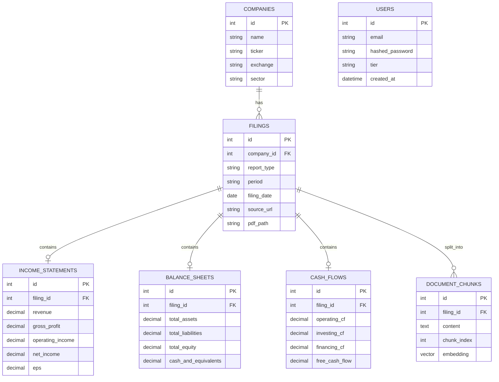

# Database Schema

!!! success "Current MVP"
    The core PostgreSQL schema for companies, filings, and financial statements is designed and migrated in Phase 2.

---

## Entity Relationship Overview



---

## Tables

### `companies`

<!-- Describe columns, indexes, and constraints -->

### `filings`

<!-- Describe columns, compound unique index on (company_id, period, report_type), soft-delete flag -->

### `income_statements`

<!-- Describe all financial line items stored, units (MYR thousands), null handling -->

### `balance_sheets`

<!-- Describe all balance sheet line items -->

### `cash_flows`

<!-- Describe cash flow statement line items -->

### `document_chunks`

<!-- Describe pgvector column type: vector(1536), HNSW index configuration -->

### `users`

!!! info "Planned Architecture (Future Phases)"
    User auth tables are added in Phase 4.

<!-- Describe user table, tier enum (free/paid), API key storage -->

---

## Migrations

<!-- Describe Alembic setup, naming convention for migration files, rollback strategy -->

---

## pgvector Setup

<!-- Describe extension installation, index type (HNSW vs IVFFlat), distance function (cosine) -->

```sql
CREATE EXTENSION IF NOT EXISTS vector;

CREATE INDEX ON document_chunks
USING hnsw (embedding vector_cosine_ops)
WITH (m = 16, ef_construction = 64);
```
