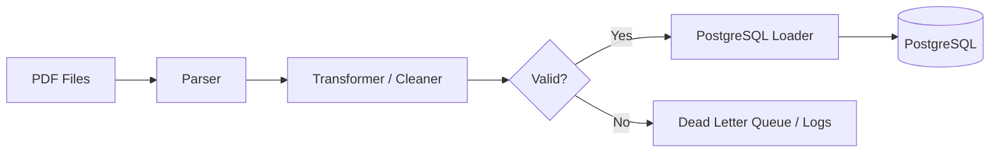

# ETL Pipeline

!!! success "Current MVP"
    The containerized ETL pipeline — from raw PDF ingestion through PostgreSQL storage — is implemented in Phase 2.

---

## Overview

<!-- Describe the end-to-end ETL: Extract (scraper), Transform (parser + cleaner), Load (PostgreSQL) -->

---

## Pipeline Diagram



---

## Orchestration

### Airflow DAG Structure

<!-- Describe DAG name, task dependencies, SLA, and retry policy -->

### Prefect Flow (Alternative)

<!-- Describe Prefect flow structure if used instead of Airflow -->

---

## Transform Logic

### Financial Data Normalization

<!-- Describe currency normalization (MYR), unit conversion (thousands → millions), fiscal year alignment -->

### Deduplication

<!-- Describe upsert logic keyed on (company_id, period, report_type) -->

### Incremental Loading

<!-- Describe how only new or updated filings are processed each run -->

---

## Docker Setup

<!-- Describe Docker Compose services: airflow-webserver, airflow-scheduler, postgres, redis -->

```yaml
# Partial docker-compose.yml structure
services:
  pipeline:
    build: ./pipeline
    volumes:
      - ./data:/app/data
    environment:
      - DATABASE_URL=postgresql://...
```

---

## Monitoring and Alerting

<!-- Describe task-level success/failure metrics, email/Slack alerts, pipeline SLA monitoring -->

---

## Data Lineage

<!-- Describe how each output row is traceable to its source PDF and parsing run -->
