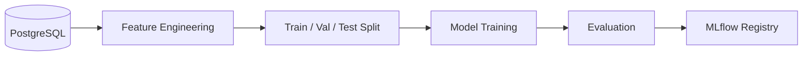

# Model Training

!!! info "Planned Architecture (Future Phases)"
    ML model training on financial datasets is implemented in **Phase 6** (Weeks 21–24).

---

## Overview

<!-- Describe the ML objective: predict market sentiment or key financial metrics from parsed report data -->

---

## Problem Formulation

### Task Definition

<!-- Describe: supervised classification (positive/negative sentiment) or regression (next-quarter metric prediction) -->

### Target Variable

<!-- Describe what is being predicted: sentiment score, EPS estimate, revenue growth rate -->

### Feature Set

<!-- Describe input features: financial ratios, narrative sentiment scores, period-over-period deltas -->

---

## Models

### Baseline — XGBoost

<!-- Describe XGBoost configuration: hyperparameter ranges, feature importance analysis -->

### Deep Learning — PyTorch

<!-- Describe neural network architecture: tabular data with financial embeddings, LSTM for time-series -->

---

## Training Pipeline

---

## Dataset

<!-- Describe training data: companies × periods, train/val/test split strategy, class imbalance handling -->

---

## Evaluation Metrics

| Metric | Description |
|---|---|
| Accuracy / F1 | Classification quality |
| MAE / RMSE | Regression error |
| AUC-ROC | Ranking quality for sentiment |

---

## Reproducibility

<!-- Describe random seed fixing, data versioning, Docker training environment -->
