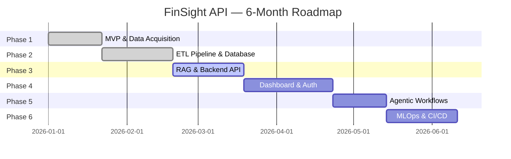

# Platform Overview

!!! success "Current MVP"
    The MVP focuses on PDF scraping, ETL, database storage, and a basic REST API with a Next.js landing page deployed on Vercel.

---

## What FinSight API Does

<!-- Describe the end-to-end flow: scrape → parse → store → expose via API → visualize → AI analysis -->

---

## Target Users

### Free Tier

<!-- Describe free-tier access: public landing page, high-level visualizations, basic company metrics -->

### Paid Tier

<!-- Describe paid-tier access: detailed dashboards, AI chatbot, developer API for algorithmic traders -->

---

## Covered Companies (MVP)

<!-- List the eight Malaysian Blue-Chip targets: Maybank, CIMB, TNB, Petronas, Maxis, Telekom, Genting, Sunway -->

| Company | Exchange | Report Type |
|---|---|---|
| Maybank | Bursa Malaysia | Quarterly / Annual |
| CIMB | Bursa Malaysia | Quarterly / Annual |
| TNB | Bursa Malaysia | Quarterly / Annual |
| Petronas | Bursa Malaysia | Annual |
| Maxis | Bursa Malaysia | Quarterly / Annual |
| Telekom Malaysia | Bursa Malaysia | Quarterly / Annual |
| Genting | Bursa Malaysia | Quarterly / Annual |
| Sunway | Bursa Malaysia | Quarterly / Annual |

---

## Monetization Strategy

<!-- Detail freemium model: free general display, paid deep-dive and API access -->

---

## Six-Month Roadmap

!!! info "Planned Architecture (Future Phases)"
    Phases 3–6 are planned and not yet implemented.

---

## Key Design Principles

<!-- Document architectural decisions: AI-native development, production-grade security, monetization-first -->
